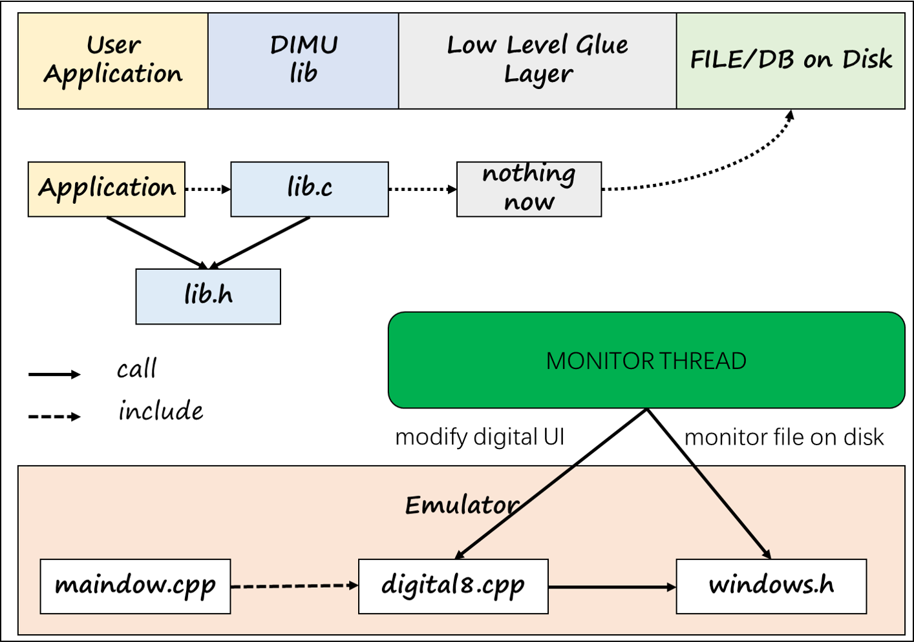
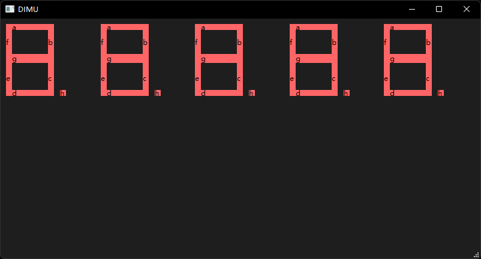

# DIMU, A Digital Emulator

A 8-bits digital tube emulator on Windows OS (temporarily)

- Base on ```Qt 6```, edit with ```Qt Creator``` and ```VS Code```

- Build with ```CMake 3.27.7```
- Examples build with ```GCC``` (x86_64-posix-seh-rev0, Built by MinGW-W64 project) 8.1.0

## hello dimu
> you can show hello on emulator GUI with applicaion code: dimu\coding\lib\example\ex4
```c
#include <stdio.h>
#include "../../src/lib.h"
#include <windows.h>

int main(int argc, char* argv[])
{
    for(int j=0;j<5;j++)
        setSpecifiedDigitalStatus(j,0);

    setSpecifiedDigitalStatus(0,0x76);//H
    setSpecifiedDigitalStatus(1,0x79);//E
    setSpecifiedDigitalStatus(2,0x38);//L
    setSpecifiedDigitalStatus(3,0x38);//L
    setSpecifiedDigitalStatus(4,0x3f);//O

    return 0;
}
```


## System Organization

### modules view
The diagram shown below is a typical, but not specific, realationships between DIMU modules.


### files view

```batch
├─build-untitled-Desktop_Qt_6_7_0_MinGW_64_bit-Debug
├─coding 
│  ├─lib
│  │  ├─example // for users
│  │  │  ├─ex1
│  │  │  ├─ex2
│  │  │  ├─ex3
│  │  │  └─ex4
│  │  ├─lib 
│  │  └─src // for developers      
│  └─toolchain
├─doc
├─img
├─lab
│  └─monitor
└─untitled
```

## Usage

### for developers
---
class digi8 has three different overload:
```c
// deafualt cstr
explicit digi8(QWidget *parent = nullptr);
// cstr with vcc file(reg status)
digi8(QWidget *parent, std::string _vccFilePath);
// cstr with flush frequency
digi8(QWidget *parent,
                std::string _vccFilePath,
                uint32_t _updatePeriod);
```
the third (with ) is which we recommend:
```c
digi8::digi8(QWidget *parent,
             std::string _vccFilePath,
             uint32_t _updatePeriod=100)
    : QWidget(parent)
    , vccFilePath_(vccFilePath)
    , updatePeriod_(_updatePeriod)
    , ui(new Ui::digi8)
```
> notice that our data member named as dataMemberName_, function parameters named as _parameterName.

add 5 digital tubes to mainwindow in constructor function of mainwindow
```c
for(int i=0;i<5;i++){
    this->digitals_[i] = new digi8(this, vccFilePaths_[i], 100);
    layout->addWidget(digitals_[i]);
}
```
the constructor function would be like:
```c
MainWindow::MainWindow(QWidget *parent)
    : QMainWindow(parent)
    , ui(new Ui::MainWindow)
{
    ui->setupUi(this);

    QWidget *centralWidget = new QWidget(this);
    this->setCentralWidget(centralWidget);
    QHBoxLayout *layout = new QHBoxLayout(centralWidget);

    for(int i=0;i<5;i++){
        digitals_[i] = new digi8(this, vccFilePaths_[i], 100);
        layout->addWidget(digitals_[i]);
    }
}
```

the DIMU GUI whould be like:



### users
---
#### emulating steps
1. build and run dimu emulator in *dimu/untitled*, with `cmake` tool and `QT6` lib.
2. build and run dimu example in *dimu/coding/lib/example/*, ex2 for example
> excute command follwing in PowerShell 
```batch
PS ex2> pwd
dimu\coding\lib\example\ex2
```
Compile and link application code, generating executable file.
```batch
PS ex2> .\makefile.bat
g++ -c ../../src/lib.c -o ../../src/lib.o
ar -rcs ../../lib/liblib.a ../../src/lib.o 
g++ example.c -o main -L ../../lib -llib
```
```batch
PS ex2> ls
300ms.png example.c main.exe makefile.bat
```
Execute main.exe, start changing vcc input to digital tube in emulator.

We can see vcc modificaiton log in terminal and the state of digital tube changes. 
> vcc modificaiton log
---
```batch
PS ex2> main.exe
hello dimu
thanks for using this lib
vcc:11000011
vcc:01000011
vcc:00000011
vcc:00000011
vcc:00000011
vcc:00000011
vcc:00000011
vcc:00000001
vcc:00000000
vcc:10000000
0 # vcc:11000000
1 # vcc:11100000
2 # vcc:11110000
3 # vcc:11111000
4 # vcc:11111100
```
> the state of digital tube changes
---


## Learned 

> Every cloud has a silver lining.

### make static link library

To make programming experience closer to real world, we'd better ecapsulate file operation into register write API.

We could offer API through static library, thus masking details except read/write to digital register, with API like `setSpecifiedDigitalStatus`
```c
/* 
    @brief
        set digital status(every reg) as bit in _stat 
    @param

        _digi: which digital to set
        _stat: digital status, bit -> reg
 */
void setSpecifiedDigitalStatus(
    unsigned int _digi,
    unsigned int _stat)
```

---
Here we show how to make static link library with gcc toolchain.

> pwd: dimu\coding\lib\example\ex4

1. generating object file
```batch
g++ -c ../../src/lib.c -o ../../src/lib.o
```
2. pack as static lib
```batch
ar -rcs ../../lib/liblib.a ../../src/lib.o
```
### link with static library
1. complie and link as application
```batch
g++ example.c -o main -L ../../lib -llib 
```

### using c++ lambda expression

> format
```c
[capture-list](parameter-list) -> return-type { 
    // function content
}
```
where capture-list is a list of external variables, parameter-list is a list of function parameters, return-type is the return type (which can be omitted and automatically deduced by the compiler), and {} is the function body.

> example1: dimu\untitled\digital8.c
```c
digi8::digi8(QWidget *parent)
    : QWidget(parent)
    , ui(new Ui::digi8)
{
    ui->setupUi(this);

    auto monThreadFunc =  [=](){monitorFileModification(vccFilePath_.c_str());};
    QThread* thread = QThread::create(monThreadFunc);
    thread->start();
}
```

> example2: dimu\coding\lib\src\lib.c
```c
auto hexToBinary = [](unsigned int hex)->std::string{
        std::string binary;
        unsigned int mask = 1;
        for (int i = 0; i < 8; i++) {
            binary += (hex & mask) ? '1' : '0';
            hex >>= 1;
        }
        cout << "binary:" << binary << endl;return binary;
    };
```

### timeout check

1. Defines a timeout in milliseconds. It then calls the GetTickCount() function to get the current system time, which is saved in the startTime variable. 

2. Enters a loop that constantly checks if the current time has exceeded startTime + timeout, and exits the loop if it expires. 

```c
#include <windows.h>
DWORD timeout = 2000;
DWORD startTime = GetTickCount();
// loop until timeout
while (GetTickCount() - startTime < timeout)
{
    // to do
    Sleep(200);
}
```

1. In the loop, performs some operations (here denoted by // to do)

2. Calls the Sleep() function to pause for 200 milliseconds to avoid looping too often and consuming CPU resources.

## MORE TO DO

- support for digital-14
- to accelerate GUI update, draw each reg by brush, instead of using label item
- fix multi digital synchronous problem


